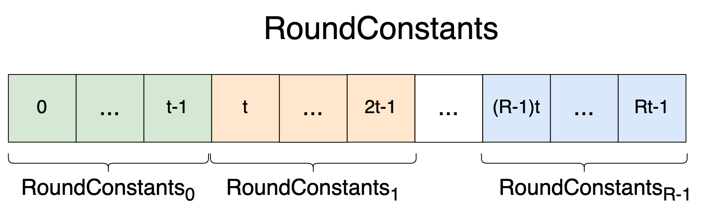
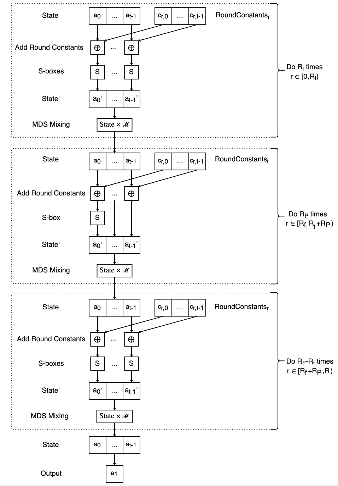
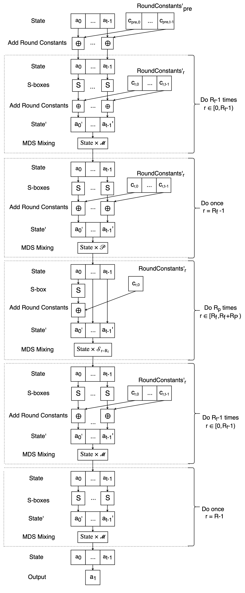

<!--lint disable -->


$$
\gdef\Zp{{\mathbb{Z}_p}}
\gdef\Zbin{{\mathbb{Z}_{2^m}}}
\gdef\thin{{\thinspace}}
\gdef\Byte{{\mathbb{B}}}
\gdef\Bit{{\{0, 1\}}}
\gdef\typecolon{\mathbin{\large :}}
\gdef\neg{{\text{-}}}
\gdef\constb{{\textbf{const }}}
\gdef\as{{\textbf{ as }}}
\gdef\msb{{\textsf{msb}}}
\gdef\if{{\text{if }}}
\gdef\ifb{{\textbf{if } \hspace{1pt}}}
\gdef\bi{{\ \ }}
\gdef\FieldBits{{\text{FieldBits}}}
\gdef\SboxBits{{\text{SboxBits}}}
\gdef\RoundConstants{{\text{RoundConstants}}}
\gdef\hso{{\hspace{1pt}}}
\gdef\Function{{\textbf{Function: }}}
\gdef\init{{\textsf{init}}}
\gdef\for{{\textbf{for }}}
\gdef\foreach{{\textbf{for each }}}
\gdef\bcolon{{\hspace{1pt} \vcenter{\boldsymbol:}}}
\gdef\state{{\textsf{state}}}
\gdef\xor{\oplus_\text{xor}}
\gdef\bit{{\textsf{bit}}}
\gdef\bits{{\textsf{bits}}}
\gdef\line#1{{{\small \rm \rlap{#1.}\hphantom{10.}} \ \ }}
\gdef\while{{\textbf{while }}}
\gdef\State{{\text{State}}}
\gdef\pluseq{\mathrel{+}=}
\gdef\return{{\textbf{return }}}
\gdef\else{{\textbf{else}}}
\gdef\len{{\textbf{len}}}
\gdef\preimage{{\textsf{preimage}}}
\gdef\DomainTag{{\text{DomainTag}}}
\gdef\Arity{{\text{Arity}}}
\gdef\HashType{{\text{HashType}}}
\gdef\MerkleTree{{\text{MerkleTree}}}
\gdef\ConstInputLen{{\text{ConstInputLen}}}
\gdef\Mds{{\mathcal{M}}}
\gdef\la{{\langle}}
\gdef\ra{{\rangle}}
\gdef\xb{{\textbf{x}}}
\gdef\yb{{\textbf{y}}}
\gdef\dotdot{{{\ldotp}{\ldotp}}}
\gdef\do{{\textbf{do }}}
\gdef\timesb{{\textbf{ times}}}
\gdef\RC{{\text{RoundConstants}}}
\gdef\Padding{{\text{Padding}}}
\gdef\push{{\textbf{.push}}}
\gdef\dotprod{{{\boldsymbol\cdot} \hso}}
\gdef\row{{\textsf{row}}}
\gdef\acc{{\textsf{acc}}}
\gdef\push{{\textbf{.push}}}
\gdef\extend{{\textbf{.extend}}}
\gdef\reverse{{\textbf{reverse}}}
\gdef\MdsInv{{\mathcal{M}^{\text{-} 1}}}
\gdef\Padding{{\text{Padding}}}
\gdef\Pre{{\mathcal{P}}}
\gdef\Sparse{{\mathcal{S}}}
\gdef\wb{{\textbf{w}}}
$$


<!--lint enable -->

# Poseidon

## General Notation

### Types

`$x \typecolon \mathbb{T}$`\
A variable `$x$` having type `$\mathbb{T}$`.

`$v \typecolon \mathbb{T}^{[n]}$`\
An array of `$n$` elements each of type `$\mathbb{T}$`.

`$m \typecolon \mathbb{T}^{[n \times n]}$`\
An `$n {\times} n$` matrix having elements of type `$\mathbb{T}$`.

`$\mathcal{I}_n \typecolon \mathbb{T}^{[n \times n]}$`\
The `$n {\times} n$` identity matrix.

`$b \typecolon \Bit$`\
A bit `$b$`.

`$\bits \typecolon \Bit^{[n]}$`\
An array `$\bits$` of `$n$` bits.

`$x \typecolon \Zp$`\
A prime field element `$x$`.

`$x \in \mathbb{Z}_{n}$`\
An integer in `$x \in [0, n)$`.

`$x \typecolon \mathbb{Z}_{\geq 0}$`\
A non-negative integer.

`$x \typecolon \mathbb{Z}_{> 0}$`\
A positive integer.

`$[n]$`\
The range of integers `$0, \dots, n - 1 \hso$`.

`$[a, b)$`\
The range of integers `$a, \dots, b - 1 \hso$`.

### Array Operations

All arrays and matrices are indexed starting at zero. An array of `$n$` elements has indices `$0, \dots, n - 1$`.

`$v[i]$`\
Returns the `$i^{th}$` element of array `$v$`. When the notation `$v[i]$` is cumbersome `$v_i$` is used instead.

`$v[i \dotdot j]$`\
Returns a slice of the array `$v$`: `$[v[i], \dots, v[j {-} 1]]$`.

`$v \parallel w$`\
Concatenates two arrays `$v$` and `$w$`, of types `$\mathbb{T}^{[m]}$` and `$\mathbb{T}^{[n]}$` respectively, producing an array of type `$\mathbb{T}^{[m + n]} \hso$`. The above is equivalent to writing `$[v_0, \dots, v_{m - 1}, w_0, \dots, w_{n - 1}]$`.

`$[f(\dots)]_{i \in \{1, 2, 3\}}$`\
Creates an array using list comprehension; each element of the array is the output of the expression `$f(\dots)$` at each element of the input sequence (e.g. `$i \in \{1, 2, 3\}$`).

`$v \mathbin{\vec\oplus} w$`\
The element-wise field addition of two equally lengthed vectors whose elements are field elements: `$v \mathbin{\vec\oplus} w = [v_0 \oplus w_0, \dots, v_{n - 1} \oplus w_{n - 1}] \hso$`.

### Matrix Operations

`$m_{i, j}$`\
Returns the value of matrix `$m$` at row `$i$` column `$j$`.

`$m_{i, \ast}$`\
Returns the `$i^{th}$` row of matrix `$m$`.

`$m_{\ast, j}$`\
Returns the `$j^{th}$` column of matrix `$m$`.

```text
$m_{1 \dotdot, 1 \dotdot} = \begin{bmatrix}
    m_{1, 1} & \dots & m_{1, c - 1} \\
    \vdots & \ddots & \vdots \\
    m_{r - 1, 1} & \dots & m_{r - 1, c - 1} \\
\end{bmatrix}$
```
Returns a submatrix of `$m$` which excludes `$m$`'s first row and first column (here `$m$` is an `$r {\times} c$` matrix).

`$m^{\neg 1}$`\
The inverse of a square `$n {\times} n$` matrix `$m$`, i.e. `$m \times m^{\neg 1} = \mathcal{I}_n$`.

```text
$v \times m = [v_0, \dots, v_{r - 1}] \begin{bmatrix}
    m_{0, 0} & \dots & m_{0, c - 1} \\
    \vdots & \ddots & \vdots \\
    m_{r - 1, 0} & \dots & m_{r - 1, c - 1} \\
\end{bmatrix} = [v \mathbin{\boldsymbol\cdot} m_{\ast, i}]_{i \in [c]}$
```
Vector-matrix multiplication where vector `$v$` is a row vector, `$m$` is a matrix, and `$\len(v) = \textbf{rows}(m)$`. The product is a row vector whose length is equal to the number of columns of `$m$`. The `$i^{th}$` element of the product vector is the dot product of `$v$` and the `$i^{th}$` column of `$m$`. In the above example `$v$` has length `$r$` and `$m$` is an `$r {\times} c$` matrix.

```text
$m \times v = \begin{bmatrix}
    m_{0, 0} & \dots & m_{0, c - 1} \\
    \vdots & \ddots & \vdots \\
    m_{r - 1, 0} & \dots & m_{r - 1, c - 1} \\
\end{bmatrix} \begin{bmatrix}
    v_0 \\
    \vdots \\
    v_{c - 1} \\
\end{bmatrix} = \begin{bmatrix}
    m_{0, \ast} \mathbin{\boldsymbol\cdot} v \\
    \vdots \\
    m_{r - 1, \ast} \mathbin{\boldsymbol\cdot} v \\
\end{bmatrix}$
```
Matrix-vector multiplication where vector `$v$` is a column vector, `$m$` is a matrix, and `$\len(v) = \textbf{columns}(m)$`. The product is a column vector whose length is equal to the number of rows of `$m$`. The `$i^{th}$` element of the product vector is the dot product of the `$i^{th}$` row of `$m$` with `$v$`. In the above example `$v$` has length `$c$` and `$m$` is an `$r {\times} c$` matrix.

**Note:** `$v \times m = (m \times v)^T$` when `$m$` is symmetric `$m = m^T$`, i.e. the row vector-matrix product contains the same elements as the column vector-matrix product when `$m$` is symmetric.

### Field Arithmetic

`$a \oplus b$`\
Addition in `$\Zp$` of two field elements `$a$` and `$b$`.

`$x^\alpha$`\
Exponentiation in `$\Zp$` of a field element `$x$` to a positive integer power `$\alpha \typecolon \mathbb{Z}_{\geq 0} \hso$`.

### Bitwise Operations

`$\oplus_\text{xor}$`\
Bitwise XOR.

`$\bigoplus_{\text{xor} \ x \in \{1, 2, 3\}} \hso x$`\
XOR's all values of a sequence. The above is equivalent to writing `$1 \oplus_\text{xor} 2 \oplus_\text{xor} 3$`.

### Bitstrings

`$[1, 0, 0] = 100_2$`\
A bit array can be written as an array `$[1, 0, 0]$` or as a bitstring `$100_2$`. The leftmost bit of the bitstring corresponds to the first bit in the array.

### Binary-Integer Conversions

`$x \as \Bit^{[n]}_\msb$`\
Converts an intger `$x \typecolon \mathbb{Z}_{\geq 0}$` into its `$n$`-bit binary representation. The most-significant bit (`$\msb$`) is first (leftmost) in the produced bit array `$\Bit^{[n]}$`, e.g. `$6 \as \Bit^{[3]}_\msb = [1, 1, 0] = 110_2$`.

`$\bits_\msb \as \mathbb{Z}_{\geq 0}$`\
Converts a bit array `$\bits \typecolon \Bit^{[n]}$` into an integer. The first bit in `$\bits$` is the most significant (`$\msb$`).

## Poseidon Symbols

`$p$`\
The prime field modulus.

`$M$`\
The security level (measured in bits). `$M$` is roughly half the field size `$M \approx \log_2(p)/2$`.

`$t$`\
The *width*; the number of field elements in a Poseidon instance's internal state array `$\state$`.

`$(p, M, t)$`\
A Poseidon instance. Each instance is fully specified using this parameter triple.

`$\alpha$`\
The S-box function's exponent `$S(x) = x^\alpha$`, where `$\gcd(\alpha, p - 1) = 1$`.

`$R_F$`\
The number of full rounds.

`$R_P$`\
The number of partial rounds.

`$R = R_F + R_P$`\
The total number of rounds

`$R_f = \lfloor R_F / 2 \rfloor$`\
Half the number of full rounds.

`$r \in [R]$`\
The index of a round.

`$r \in [R_f]$`\
The round index for a first-half full round.

`$r \in [R_f, R_f + R_P)$`\
The round index for a partial round.

`$r \in [R_f + R_P, R)$`\
The round index for a second-half full round.

`$\state$`\
A Poseidon instance's internal state array of `$t$` field elements `$\Zp$` which are transformed in each round.

`$\RC$`\
The round constants for an unoptimized Poseidon instance.

`$\RC_r$`\
The round constants that are added to Poseidon's `$\state$` array before the S-boxes in round `$r$` of an unoptimized Poseidon instance.

`$\RC'$`\
The round constants for an optimized Poseidon instance.

`$\RC'_\text{pre}$`\
The round constants that are added to Poseidon's `$\state$` array before the S-boxes in the first round `$r = 0$` of an optimized Poseidon instance.

`$\RC'_r$`\
The round constants that are added to Poseidon's `$\state$` array after the S-boxes in round `$r$` in an optimized Poseidon instance.

`$\Mds$`\
The MDS matrix for a Poseidon instance.

`$\Pre$`\
The *pre-sparse* matrix used in MDS mixing for the last first-half full round (`$r = R_f - 1$`) of the optimized Poseidon algorithm.

`$\Sparse$`\
An array of matrices used in MDS mixing for the partial rounds `$r \in [R_f, R_f + R_P)$` of the optimized Poseidon algorithm.

## Instantiation

The parameter triple `$(p, M, t)$` fully specifies a unique instance of Poseidon (a hash function that uses the same constants and parameters and performs the same operations). All other Poseidon parameters and constants are derived from the instantiation parameters.

The S-box exponent `$\alpha$` is derived from the field modulus `$p$` such that `$a \in \{3, 5\}$` and `$\gcd(\alpha, p - 1) = 1$`.

The round numbers `$R_F$` and `$R_P$` are derived from the field size and security level `$(\lceil \log_2(p) \rceil, M)$`.

The `$\RC$` are derived from `$(p, M, t)$`.

The MDS matrix `$\Mds$` is derived from the width `$t$`.

The allowed preimage sizes are `$\len(\preimage) \in [1, t)$`.

The total number of operations executed per hash is determined by the width and number of rounds `$(t, R_F, R_P)$`.

## Poseidon in Filecoin

```text
$p = 52435875175126190479447740508185965837690552500527637822603658699938581184513$`\
$\hphantom{p} = \text{0x1a0111ea397fe69a4b1ba7b6434bacd764774b84f38512bf6730d2a0f6b0f6241eabfffeb153ffffb9feffffffffaaab}$
```
The prime field modulus in base-10 and base-16. Filecoin uses BLS12-381's scalar field for the Poseidon prime field `$\Zp$`. Filecoin's modulus `$p$` is equal to the order of the BLS12-381 curve group's prime order subgroup `$\mathbb{G}1$`.

`$M = 128 \ \text{Bits}$`\
Filecoin targets the 128-bit security level (`$M$` is roughly half the field size `$M \approx \log_2(p) / 2$` where `$\log_2(p) \approx 256$`).

```text
$t = \text{preimage length} + \text{output length} = \text{preimage length} + 1 = \Arity + 1$`\
$t \in \{3, 5, 9, 12\}$
```
The size in field elements of Poseidon's internal state. Filecoin's Poseidon instances take preimages of varying  lengths (2, 4, 8, and 11 field elements) and always return one field element.

The Filecoin protocol uses different Poseidon widths for different applications:
* `$t = 3$` is used to hash 2:1 Merkle trees (*BinTrees*) and to derive SDR-PoRep's `$\text{CommR}$`
* `$t = 5$` is used to hash 4:1 Merkle trees (*QuadTrees*)
* `$t = 9$` is used to hash 8:1 Merkle trees (*OctTrees*)
* `$t = 12$` is used to hash SDR-PoRep *columns* of 11 field elements

`$\alpha = 5$`\
The S-box function's `$S(x) = x^\alpha$` exponent. It is required that `$\alpha$` is relatively prime to `$p - 1$`, i.e. `$\gcd(\alpha, p - 1) = 1$`, which is true for Filecoin's choice of `$p$`.

## Round Numbers

The Poseidon round numbers are the number of full and partial rounds `$(R_F, R_P)$` for a Poseidon instance `$(p, M, t)$`. The round numbers are chosen such that they minimize the total number of S-boxes:

`$\text{Number of S-boxes} = tR_F + R_P$`\

while providing security against known attacks (statistical, interpolation, and Gröbner basis).

`$R_F$` and `$R_P$` are calculated using either the Python script [`calc_round_numbers.py`](https://extgit.iaik.tugraz.at/krypto/hadeshash/-/blob/9d80ec0473ad7cde5a12f3aac46439ad0da68c0a/code/scripts/calc_round_numbers.py) or the [`neptune`](https://github.com/filecoin-project/neptune) Rust library. Both methods calculate the round numbers via brute-force; by iterating over all reasonable values for `$R_F$` and `$R_P$` and choosing the pair that satisfies the security inequalities (see below) while minimizing the number of S-boxes.

`$\constb (R_F, R_P) = \texttt{calc_round_numbers}(p, M, t, \alpha)$`\
The number of full and partial rounds; both are positive integers `$R_F, R_P \typecolon \mathbb{Z}_{> 0}$`.

`$\constb R = R_F + R_P$`\
The total number of rounds.

`$\constb R_f = \lfloor R_F / 2 \rfloor$`\
Half the number of full rounds.

### Security Inequalities

The round numbers `$(R_F, R_P)$` are chosen such that they satisfy the following inequalities:

`$(1) \quad 2^M \leq p^t \Longleftrightarrow M \leq t\log_2(p)$`\
The security level must be less than the bit-length of Poseidon's internal state vector `$\Zp^{[t]}$` (taken from Appendix C.1.1 in the [Poseidon Paper](https://eprint.iacr.org/2019/458.pdf)).  This is always satisfied for Filecoin's choice of `$p$` and `$M$`.

`$(2) \quad R_f \geq 6$`\
The minimum `$R_F$` necessary to prevent statistical attacks (Eq. 2 Section 5.5.1 in the [Poseidon Paper](https://eprint.iacr.org/2019/458.pdf) where `$\lfloor \log_2(p) \rfloor - 2 = 252$` and `$\mathcal{C} = 2$` for `$\alpha = 5$`).

```text
$(3) \quad R > \lceil M \log_\alpha(2) \rceil + \lceil \log_\alpha(t) \rceil \Longrightarrow R > \begin{cases}
57 & \if t \in [2, 5] \\
58 & \if t \in [6, 25]
\end{cases}$
```
The minimum number of total rounds necessary to prevent interpolation attacks (Eq. 3 Section 5.5.2 of the [Poseidon Paper](https://eprint.iacr.org/2019/458.pdf)).

```text
$(4 \text{a}) \quad R > {M \log_\alpha(2) \over 3} \Longrightarrow R > 18.3$
$(4 \text{b}) \quad R > t - 1 + {M \log_\alpha(2) \over t + 1}$
```
The minimum number of total rounds required to prevent against Gaussian elimination attacks (both equations must be satisfied, Eq. 5 from Section 5.5.2 of the [Poseidon Paper](https://eprint.iacr.org/2019/458.pdf)).

## Round Constants

For each distinct Poseidon instance an array `$\RC$` of `$Rt$` field elements is generated (`$t$` field elements per round) using the Grain-LFSR stream cipher whose 80-bit state is initialized to an encoding of the Poseidon instance.

```text
$\constb \FieldBits \typecolon \Bit^{[2]}_\msb = \begin{cases}
    0 & \text{if using a binary field } \Zbin \\
    1 & \text{if using a prime field } \Zp \\
\end{cases} = 01_2$
```
Specifies the field type as prime or binary. Filecoin uses a prime field `$\Zp$`, however the Poseidon paper allows Poseidon to be instantiated over binary fields `$\Zbin$`.

```text
$\constb \SboxBits \typecolon \Bit^{[4]}_\msb = \begin{cases}
    0 & \if \alpha = 3 \\
    1 & \if \alpha = 5 \\
    2 & \if \alpha = \neg 1 \\
\end{cases} = 0001_2$
```
Specifies the S-box exponent `$\alpha$`. Filecoin uses `$\alpha = 5$`.

`$\constb \text{FieldSizeBits} \typecolon \Bit^{[12]}_\msb = \lceil \log_2(p) \rceil = 255 = 000011111111_2$`\
The bit-length of the field modulus.

```text
$\constb \text{GrainState}_\text{init} \typecolon \Bit^{[80]} =$
$\quad \text{FieldBits}$
$\quad \Vert \ \SboxBits$
$\quad \Vert \ \text{FieldSizeBits}$
$\quad \Vert \ t \as \Bit^{[12]}_\msb$
$\quad \Vert \ R_F \as \Bit^{[10]}_\msb$
$\quad \Vert \ R_P \as \Bit^{[10]}_\msb$
$\quad \Vert \ 1^{[30]}$
```
Initializes the Grain LFSR stream cipher which is used to derive `$\RC$` for a Poseidon instance `$(p, M, t)$`.

`$\constb \RC \typecolon \Zp^{[Rt]}$`\
The round constants for a Poseidon instance `$(p, M, t)$`.

```text
$\overline{\underline{\textbf{Algorithm: } \RC}}$
$\line{1} \state \typecolon \Bit^{[80]} = \text{GrainState}_\init$
$\line{2} \textbf{do } 160 \timesb \bcolon$
$\line{3} \quad \bit \typecolon \Bit = \bigoplus_{\text{xor} \ i \hso \in \{0, 13, 23, 38, 51, 62\}} \thin \state[i]$
$\line{4} \quad \state = \state[1 \dotdot] \parallel \bit$
$\line{5} \RC \typecolon \Zp^{[Rt]} = [\ ]$
$\line{6} \while \len(\RC) < Rt \bcolon$
$\line{7} \quad \bits \typecolon \Bit^{[255]} = [\ ]$
$\line{8} \quad \while \len(\bits) < 255 \bcolon$
$\line{9} \quad\quad \bit_1 = \bigoplus_{\text{xor} \ i \hso \in \{0, 13, 23, 38, 51, 62\}} \thin \state[i]$
$\line{10} \quad\quad \state = \state[1 \dotdot] \parallel \bit_1$
$\line{11} \quad\quad \bit_2 = \bigoplus_{\text{xor} \ i \hso \in \{0, 13, 23, 38, 51, 62\}} \thin \state[i]$
$\line{12} \quad\quad \state = \state[1 \dotdot] \parallel \bit_2$
$\line{13} \quad\quad \ifb \bit_1 = 1 \bcolon$
$\line{14} \quad\quad\quad \bits\push(\bit_2)$
$\line{15} \quad c = \bits_\msb \as \mathbb{Z}_{2^{255}}$
$\line{16} \quad \if c \in \Zp \bcolon$
$\line{17} \quad\quad \RC\push(c)$
$\line{18} \return \RC$
```



`$\constb \RC_r \typecolon \Zp^{[t]} = \RC[rt \dotdot (r + 1)t]$`\
Denotes the round constants for round `$r \in [R]$` for an unoptimized Poseidon instance.

## MDS Matrix

```text
$\constb \xb \typecolon \Zp^{[t]} = [0, \dots, t - 1]$
$\constb \yb \typecolon \Zp^{[t]} = [t, \dots, 2t - 1]$

$\constb \Mds \typecolon \Zp^{[t \times t]} = \begin{bmatrix}
(\xb_0 + \yb_0)^{\neg 1} & \dots & (\xb_0 + \yb_{t - 1})^{\neg 1} \\
\vdots & \ddots & \vdots \\
(\xb_{t - 1} + \yb_0)^{\neg 1} & \dots & (\xb_{t - 1} + \yb_{t - 1})^{\neg 1} \\
\end{bmatrix}$
```

The MDS matrix `$\Mds$` for a Poseidon instance of width `$t$`. The superscript `$^{\neg 1}$` denotes a multiplicative inverse `$\text{mod } p$`. The MDS matrix is invertible and symmetric.

## Domain Separation

Every preimage hashed by a Poseidon instance is associated with a hash type `$\HashType$` to specify how Poseidon is being used. Filecoin uses two hash types: one designating a preimage as being for a Merkle tree hash function of arity `$t - 1$` and a second designating a preimage as having length `$\len(\preimage) < t$` and having no specific application.

The `$\HashType$` for a preimage determines the first element of Poseidon's initial `$\state[0] = \DomainTag$`, and any padding `$\Padding$` that is applied to Poseidon's initial `$\state$`.

`$\constb \HashType \in \{ \MerkleTree, \ConstInputLen \}$`\
The allowed hash types in which to hash a preimage for a Poseidon instance `$(p, M, t)$`. It is required that `$0 < \len(\preimage) < t \hso$`.

* A `$\HashType$` of `$\MerkleTree$` designates a preimage as being the preimage of a Merkle tree hash function, where the tree is `$t {-} 1 \hso {:} \hso 1$` (i.e. `$\Arity = \len(\preimage)$` number of nodes are hashed into `$1$` node).
* A `$\HashType$` of `$\ConstInputLen$` designates Poseidon as being used to hash preimages of length exactly `$\len(\preimage)$` into a single output element (where `$0 < \len(\preimage) < t$`).

```text
$\constb \DomainTag \typecolon \Zp = \begin{cases}
2^\Arity - 1 & \if \HashType = \MerkleTree \\
2^{64} \hso \len(\preimage) & \if \HashType = \ConstInputLen \\
\end{cases}$
```
The first element `$\state[0] = \DomainTag$` of the initial Poseidon `$\state$`.

```text
$\constb \Padding \typecolon \Zp^{[*]} = \begin{cases}
[\ ] & \if \HashType = \MerkleTree \\
0^{[t - 1 - \len(\preimage)]} & \if \HashType = \ConstInputLen \\
\end{cases}$
```
The padding that is applied to Poseidon's initial state. If `$\HashType = \MerkleTree$`, no padding is applied. Otherwise, if `$\HashType = \ConstInputLen$`, the last `$t - 1 - \len(\preimage)$` elements of Poseidon's initial `$\state$` are set to zero.

## Unoptimized v.s. Optimized

Filecoin's rust library [`neptune`](https://github.com/filecoin-project/neptune) implements the Poseidon hash function. The library differentiates between unoptimized and optimized Poseidon using the terms *correct* and *static* respectively.

The primary differences between the two versions are:

* the unoptimized algorithm uses the round constants `$\RC$`, performs round constant addition before S-boxes, and uses the MDS matrix `$\Mds$` for mixing
* the optimized algorithm uses the transformed rounds constants `$\RC'$` (containing fewer constants than `$\RC$`), performs a round constant addition before the first round's S-box, performs round constant addition after every S-box other than the last round's, and uses multiple matrices for MDS mixing `$\Mds$`, `$\Pre$`, and `$\Sparse$`. This change in MDS mixing from a non-sparse matrix `$\Mds$` to sparse matrices `$\Sparse$` greatly reduces the number of multiplications in each round.

For a given Poseidon instance `$(p, M, t)$` the optimized and unoptimized algorithms will produce the same output when provided with the same input.

## Unoptimized Poseidon

The Posiedon hash function takes a preimage of `$t - 1$` prime field `$\Zp$` elements to a single field element. Poseidon operates on an internal state `$\state$` of `$t$` field elements which, in the unoptimized algorithm, are transformed over `$R$` number of rounds of: round constant addition, S-boxes, and MDS matrix mixing. Once all rounds have been performed, Poseidon outputs the second element of the state.

A Posiedon hash function is instantiated by a parameter triple `$(p, M, t)$` which sets the prime field, the security level, and the size of Poseidon's internal state buffer `$\state$`. From `$(p, M, t)$` the remaining Poseidon parameters are computed `$(\alpha, R_F, R_P, \RC, \Mds)$`, i.e. the S-box exponent, the round numbers, the round constants, and the MDS matrix.

The S-box function is defined as:

```text
$S: \Zp \rightarrow \Zp$
$S(x) = x^\alpha$
```

The `$\state$` is initialized to the concatenation of the `$\DomainTag$`, `$\preimage$`, and `$\Padding$`:

`$\state = \DomainTag \parallel \preimage \parallel \Padding$`$\

Every round `$r \in [R]$` begins with `$t$` field additions of the `$\state$` with that round's constants `$\RC_r \hso$`:

`$\state = [\state[i] \oplus \RoundConstants_r[i]]_{i \in [t]}$`\

If `$r$` is a full round, i.e. `$r < R_f$` or `$r \geq R_f + R_P$`, the S-box function is applied to each element of `$\state$`:

`$\state = [\state[i]^\alpha]_{i \in [t]}$`\

otherwise, if `$r$` is a partial round `$r \in [R_f, R_f + R_P)$`, the S-box function is applied to just the first `$\state$` element:

`$\state[0] = \state[0]^\alpha$`\

Once the S-boxes have been applied for a round, the `$\state$` is transformed via vector-matrix multiplication with the MDS matrix `$\Mds$`:

`$\state = \state \times \Mds$`\

After `$R$` rounds of the above procedure, Poseidon outputs the digest `$\state[1]$`.

```text
$\overline{\underline{\Function \textsf{poseidon}(\preimage \typecolon \Zp^{[t - 1]}) \rightarrow \Zp}}$
$\line{1} \state \typecolon \Zp^{[t]} = \DomainTag \parallel \preimage \parallel \Padding$
$\line{2} \for r \in [R_f] \bcolon$
$\line{3} \quad \state = [(\state[i] \oplus \RoundConstants_r[i])^5]_{i \in [t]} \times \Mds$
$\line{4} \for r \in [R_f, R_f + R_P) \bcolon$
$\line{5} \quad \state = [\state[i] \oplus \RoundConstants_r[i]]_{i \in [t]}$
$\line{6} \quad \state[0] = \state[0]^5$
$\line{7} \quad \state = \state \times \Mds$
$\line{8} \for r \in [R_f + R_P, R) \bcolon$
$\line{9} \quad \state = [(\state[i] \oplus \RoundConstants_r[i])^5]_{i \in [t]} \times \Mds$
$\line{10} \return \state[1]$
```



## Optimized Round Constants

Given the round constants `$\RC$` and MDS matrix `$\Mds$` for a Poseidon instance, we are able to derive round constants `$\RC'$` for the optimized Poseidon algorithm.


`$\constb \RC' \typecolon \Zp^{[tR_F + R_P]}$`\
The round constants for a Poseidon instance's `$(p, M, t)$` optimized hashing algorithm. Each full round is associated with `$t$` round constants, while each partial round is associated with one constant.

```text
$\overline{\underline{\textbf{Algorithm: } \RC'}}$
$\line{1} \RC' \typecolon \Zp^{[tR_F + R_P]} = [\ ]$
$\line{2} \RC'\extend(\RC_0)$
$\line{3} \for r \in [1, R_f) \bcolon$
$\line{4} \quad \RC'\extend(\RC_r \hso {\times} \hso \MdsInv)$
$\line{5} \textsf{partial\_consts} \typecolon \Zp^{[R_P]} = [\ ]$
$\line{6} \acc \typecolon \Zp^{[t]} = \RC_{R_f + R_P}$
$\line{7} \for r \in \reverse([R_f, R_f + R_P)) \bcolon$
$\line{8} \quad \acc' = \acc \hso {\times} \hso \MdsInv$
$\line{9} \quad \textsf{partial\_consts}\push(\acc'[0])$
$\line{10} \quad \acc'[0] = 0$
$\line{11} \quad \acc = \acc' \mathbin{\vec\oplus} \RC_r$
$\line{12} \RC'\extend(\acc \hso {\times} \hso \MdsInv)$
$\line{13} \RC'\extend(\reverse(\textsf{partial\_consts}))$
$\line{14} \for r \in [R_f + R_P + 1, R)$
$\line{15} \quad \RC'\extend(\RC_r \hso {\times} \hso \MdsInv)$
$\line{16} \return \RC'$
```

**Algorithm Comments:**
**Note:** `$\times$` denotes row-vector-matrix multiplication which outputs a row-vector.
**Line 2.** The first `$t$` round constants are unchanged. Note that both `$\RC'_0$` and `$\RC'_1$` are used in the first optimized round `$r = 0$`.
**Lines 3-4.** For each first-half full round, transform the round constants into `$\RC_r \hso {\times} \hso \MdsInv$`.
**Lines 5.** Create a variable to store the round constants for the partial rounds `$\textsf{partial\_consts}$` (in reverse order)
**Lines 6.** Create and initialize a variable `$\acc$` that is transformed and added to `$\RC_r$` in each `$\textbf{do}$` loop iteration.
**Lines 7-11.** For each partial round `$r$` (starting from the greatest partial round index `$R_f + R_P - 1$` and proceeding to the least `$R_f$`) transform `$\acc$` into `$\acc \hso {\times} \hso \MdsInv$`, take its first element as a partial round constant, then perform element-wise addition with `$\RC_r$`. The value of `$\acc$` at the end of the `$i^{th}$` loop iteration is:

`$\acc_i = \RC_r[0] \parallel ((\acc_{i - 1} \hso {\times} \hso \MdsInv)[1 \dotdot] \mathbin{\vec\oplus} \RC_{r}[1 \dotdot])$`\

**Line 12.** Set the last first-half full round's constants using the final value of `$\acc$`.
**Line 13.** Set the partial round constants.
**Lines 14-15.** Set the remaining full round constants.

`$\constb \RC'_\text{pre} \typecolon \Zp^{[t]} = \RC'[\dotdot t]$`\
The first `$t$` constants in `$\RC'$` are added to `$\state$` prior to applying the S-box in the first round round `$r = 0$`.

```text
$\constb \RC'_r \typecolon \Zp^{[\ast]} = \begin{cases}
    \RC'[(r + 1)t \dotdot (r + 2)t] & \if \hso r \in [R_f] & \\
    \RC'[(R_f + 1)t + \delta] & \if r \in [R_f, R_f + R_P) & ^\ast\text{where } \delta = r - R_f \\
    \RC'[(R_f + \delta + 1)t + R_P \hso \dotdot \hso (R_f + \delta + 2)t + R_P] & \if r \in [R_f + R_P, R - 2] & ^\ast\text{where } \delta = r - (R_f + R_P) \\
\end{cases}$
```
For each round excluding the last `$r \in [R - 1]$`, `$\RC'_r$` is added to the Poseidon `$\state$` after taht round's S-box has been applied.

## Sparse MDS Matrices

A *sparse matrix* `$m$` is a square `$n {\times} n$` matrix whose first row and first column are utilized and where all other entries are the `$n {-} 1 {\times} n {-} 1$` identity matrix `$\mathcal{I}_{n - 1}$`:

```text
$m = \left[ \begin{array}{c|c}
    m_{0, 0} & m_{0, 1 \dotdot} \\
    \hline
    m_{1 \dotdot, 0} & \mathcal{I}_{n - 1} \\
\end{array} \right] = \begin{bmatrix}
    m_{0, 0} & \dots & \dots & m_{0, n - 1} \\
    \vdots & 1 & \dots & 0 \\
    \vdots & \vdots & \ddots & \vdots \\
    m_{n - 1, 0} & 0 & \dots & 1 \\
\end{bmatrix}$
```

The MDS matrix `$\Mds$` is factored into a non-sparse matrix `$\Pre$` and an array of sparse matrices `$\Sparse = [\Sparse_0, \dots, \Sparse_{R_P - 1}]$` (one matrix per partial round). `$\Pre$` is used in MDS mixing for the last first-half full round `$r = R_f - 1$`. Each matrix of `$\Sparse$` is used in MDS mixing for a partial round. `$\Sparse_0$` is used in the first partial round (`$r = R_f$`) and `$\Sparse_{R_P - 1}$` is used in the last partial round (`$r = R_f + i$`).

`$\constb \Pre \typecolon \Zp^{[t \times t]}$`\
The *pre-sparse* matrix (a non-sparse matrix) used in MDS mixing for round for the last full round of the first-half `$r = R_f - 1$`. Like the MDS matrix `$\Mds$`, the pre-sparse matrix `$\Pre$` is symmetric.

`$\constb \Sparse \typecolon {\Zp^{[t \times t]}}^{[R_P]}$`\
The array of sparse matrices that `$\Mds$` is factored into, which are used for MDS mixing in the optimized partial rounds.

```text
$\overline{\underline{\textbf{Algorithm: } \Pre, \Sparse}}$
$\line{1} \textsf{sparse} \typecolon {\Zp^{[t \times t]}}^{[R_P]} = [\ ]$
$\line{2} m \typecolon \Zp^{[t \times t]} = \Mds$
$\line{3} \do R_P \timesb \bcolon$
$\line{4} \quad (m', m'') \typecolon (\Zp^{[t \times t]}, \Zp^{[t \times t]}) = \textbf{sparse\_factorize}(m)$
$\line{5} \quad \textsf{sparse}\push(m'')$
$\line{6} \quad m = \Mds \times m'$
$\line{7} \Pre = m$
$\line{8} \Sparse = \reverse(\textsf{sparse})$
$\line{9} \return \Pre, \Sparse$
```

**Algorithm Comments:**
**Line 1.** An array containing the sparse matrices that `$\Mds$` is factored into.
**Line 2.** An array `$m$` that is repeatedly factored into a non-sparse matrix `$m'$` and a sparse matrix `$m''$`, i.e. `$m = m' \times m''$`.
**Lines 3-6.** In each loop iteration we factor `$m$` into `$m'$` and `$m''$`. The first `$\textbf{do}$` loop iteration calculates the sparse matrix `$m''$` used in MDS mixing for last partial round `$r = R_f + R_P - 1$`. The last `$\textbf{do}$` loop iteration calculates the sparse matrix `$m''$` used in MDS mixing for the first partial round `$r = R_f$` (i.e. `$\Sparse_0 = m''$`).
**Line 6.** `$\Mds \times m'$` is a matrix-matrix multiplication which produces a `$t {\times} t$` matrix.

The function `$\textsf{sparse\_factorize}$` factors a non-sparse matrix `$m$` into a non-sparse matrix `$m'$` and sparse matrix `$m''$` such that `$m = m' \times m''$`.

```text
$\overline{\underline{\Function \textsf{sparse\_factorize}(m \typecolon \Zp^{[t {\times} t]}) \rightarrow (m' \typecolon \Zp^{[t {\times} t]} \hso, m'' \typecolon \Zp^{[t {\times} t]})}}$
$\line{1} \hat{m} \typecolon \Zp^{[t - 1 {\times} t - 1]} = m_{1 \dotdot, 1 \dotdot} = \begin{bmatrix}
m_{1, 1} & \dots & m_{1, t - 1} \\
\vdots & \ddots & \vdots \\
m_{t - 1, 1} & \dots & m_{t - 1, t - 1} \\
\end{bmatrix}$

$\line{2} m' \typecolon \Zp^{[t {\times} t]} = \left[ \begin{array}{c|c}
    1 & 0 \\
    \hline
    0 & \hat{m}
\end{array} \right] = \begin{bmatrix}
    1 & 0 & \dots & 0 \\
    0 & m_{1, 1} & \dots & m_{1, t - 1} \\
    \vdots & \vdots & \ddots & \vdots \\
    0 & m_{t - 1, 1} & \dots & m_{t - 1, t - 1} \\
\end{bmatrix}$

$\line{3} \wb \typecolon \Zp^{[t - 1 {\times} 1]} = \hat{m}_{\ast, 0} = \begin{bmatrix}
    \hat{m}_{0, 0} \\
    \vdots \\
    \hat{m}_{t - 2, 0} \\
\end{bmatrix} = m_{1 \dotdot, 1} = \begin{bmatrix}
    m_{1, 1} \\
    \vdots \\
    m_{t - 1, 1} \\
\end{bmatrix}$

$\line{4} \hat\wb \typecolon \Zp^{[t - 1 {\times} 1]} = \hat{m}^{\neg 1} {\times} \hso \wb = \begin{bmatrix}
    {\hat{m}^{\neg 1}}_{0, \ast} \mathbin{\boldsymbol\cdot} \wb \\
    \vdots \\
    {\hat{m}^{\neg 1}}_{t - 2, \ast} \mathbin{\boldsymbol\cdot} \wb \\
\end{bmatrix}$

$\line{5} m'' \typecolon \Zp^{[t {\times} t]} = \left[ \begin{array}{c|c}
    m_{0, 0} & m_{0, 1 \dotdot} \\
    \hline
    \hat{\textbf{w}} & \mathcal{I}_{t - 1} \\
\end{array} \right] = \begin{bmatrix}
    m_{0, 0} & \dots & \dots & m_{0, t - 1} \\
    \hat{\textbf{w}}_0 & 1 & \dots & 0 \\
    \vdots & \vdots & \ddots & \vdots \\
    \hat{\textbf{w}}_{t - 2} & 0 & \dots & 1 \\
\end{bmatrix}$
$\line{6} \return m', m''$
```

**Algorithm Comments:**
**Line 1.** `$\hat{m}$` is a submatrix of `$m$` which excludes `$m$`'s first row and first column.
**Line 2.** `$m'$` is a copy of `$m$` where `$m$`'s first row and first column have been replaced with `$[1, 0, \dots, 0]$`.
**Line 3.** `$\wb$` is a column vector which is the first column of `$\hat{m}$` or the second column of `$m$` excluding the first row's value.
**Line 4.** `$\hat\wb$` is the matrix-column vector product of `$\hat{m}^{\neg 1}$` and `$\wb$`.
**Line 5.** `$m''$` is a sparse matrix whose first row is the first row of `$m$`, remaining first column is `$\hat\wb$`, and remaining entries are the identity matrix.

## Optimized Poseidon

The optimized Poseidon hash function is instantiated in the same way as the unoptimized algorithm, however the optimized Poseidon algorithm requires the additional precomputation of round constants `$\RC'$`, a *pre-sparse* matrix `$\Pre$`, and sparse matrices `$\Sparse$`.

Prior to the first round `$r = 0$`, the state is initialized and added to the *pre-* round constants `$\RC'_\text{pre}$`:

```text
$\state = \DomainTag \parallel \preimage \parallel \Padding$
$\state = \state \mathbin{\vec\oplus} \RC'_\text{pre}$
```

For each full round of the first-half `$r \in [R_f]$`: the S-box function is applied to each element of `$\state$`, the output of each S-box is added to the associated round constant in `$\RC'_r$`, and MDS mixing occurs between `$\state$` and the MDS matrix `$\Mds$` or the *pre-sparse* matrix `$\Pre$` (when `$r < R_f - 1$` and `$r = R_f - 1$` respectively).

```text
$\state = \begin{cases}
    [\state[i]^\alpha \oplus \RC'_r[i]] \times \Mds & \if r \in [R_f - 1] \\
    [\state[i]^\alpha \oplus \RC'_r[i]] \times \Pre & \if r = R_f - 1 \\
\end{cases}$
```

For each partial round `$r \in [R_f, R_f + R_P)$` the S-box function is applied to the first `$\state$` element, the round constant is added to the first `$\state$` element, and MDS mixing occurs between the `$\state$` and the `$i^{th}$` sparse matrix `$\Sparse_i$` (the `$i^{th}$` partial round `$i \in [R_P]$` is associated with sparse matrix `$\Sparse_i$` where `$i = r - R_f$`):

```text
$\state[0] = \state[0]^\alpha \oplus \RC'_r$
$\state = \state \times \Sparse_{r - R_f}$
```

The second half of full rounds `$r \in [R_f + R_P, R)$` proceed in the same way as the first half of full rounds except that all MDS mixing uses the MDS matrix `$\Mds$` and that the last round `$r = R - 1$` does not add round constants into `$\state$`.

After performing `$R$` rounds, Poseidon outputs the digest `$\state[1]$`.

```text
$\overline{\underline{\Function \textsf{poseidon}(\preimage \typecolon \Zp^{[t - 1]}) \rightarrow \Zp}}$
$\line{1} \state \typecolon \Zp^{[t]} = \DomainTag \parallel \preimage \parallel \Padding$
$\line{2} \state = [\state[i] \oplus \RC'_\text{pre}[i]]_{i \in [t]}$
$\line{3} \for r \in [R_f - 1] \bcolon$
$\line{4} \quad \state = [\state[i]^5 \oplus \RC'_r[i]]_{i \in [t]} \times \Mds$
$\line{5} \state = [\state[i]^5 \oplus \RC'_{R_f - 1}[i]]_{i \in [t]} \times \mathcal{P}$
$\line{6} \for r \in [R_f, R_f + R_P) \bcolon$
$\line{8} \quad \state[0] = \state[0]^5 \oplus \RC'_r$
$\line{9} \quad \state = \state \times \mathcal{S}_{r - R_f}$
$\line{10} \for r \in [R_f + R_P, R - 1) \bcolon$
$\line{11} \quad \state = [\state[i]^5 \oplus \RC'_r[i]]_{i \in [t]} \times \Mds$
$\line{12} \state = [\state[i]^5]_{i \in [t]} \times \Mds$
$\line{13} \return \state[1]$
```

**Algorithm Comments:**
**Line 2.** Add pre- `$r{=}0$` round constants.
**Line 3-4.** Perform first-half full rounds up to and excluding the last (mixing is done using `$\Mds$`).
**Line 5.** Perform the last first-half full round `$r {=} R_f - 1$` (mixing is done using the *pre-sparse* matrix `$\mathcal{P} \hso$`).
**Lines 6-9.** Perform the partial rounds (mixing is done using each round `$r$`'s sparse matrix `$\mathcal{S}_{r - R_f}$`).
**Lines 10-11.** Perform the second-half full rounds excluding the last round (mixing is done using `$\Mds$`).
**Line 12.** Perform the last round where no round constants are added (mixing is done using `$\Mds$`).


